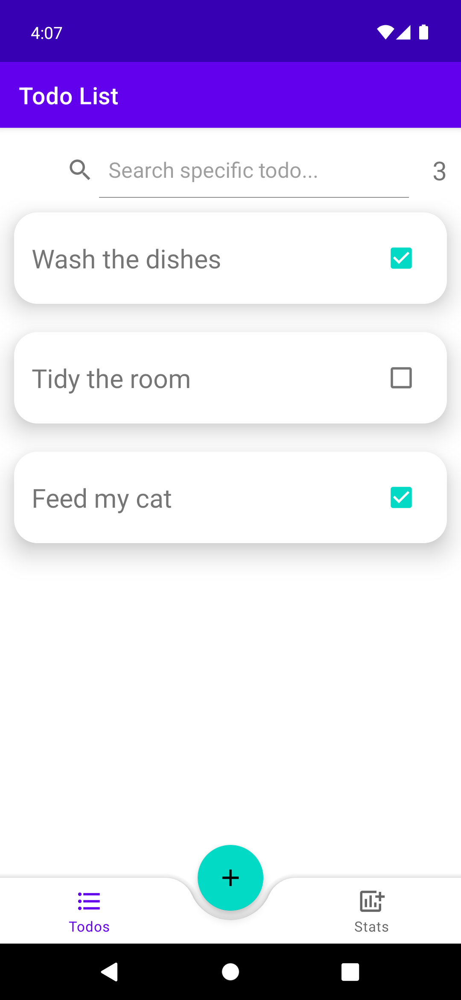

### Overview
Todo List is an app, where you can store your things to do. It helps you not to forget what you were going to do, and also helps you to track what things you have already done.
___
### Appearance

___
### Include The Following Libraries:
- Room
- Dagger-Hilt
___
### What Is Already Done:
- RecyclerView shows the list of Todos on the screen
- User can add new Todo to the end of list
- User can search a specific Todo(s) via search line
- User can delete a todo by swiping it right
- If user accidentally delete a Todo he can undo this action in bottom Snackbar menu
- User can mark Todo as completed and it makes changes in database
___
### What Is In The Process Of Implementation:
- Made an adding new Todo via BottomAppBar instead of using separate Fragment
- A red background with the icon of bin, when user swipes the Todo right and delete it
___
### What Is Expected To Be Implemented In The Future:
- Add new parameter for Todo: date of creation
- Sorting Todos alphabetically
- New screen for statistics of user activity (how many todos he has done etc.)
- Smooth, concise design

*Last Update: 25.09.2022*
